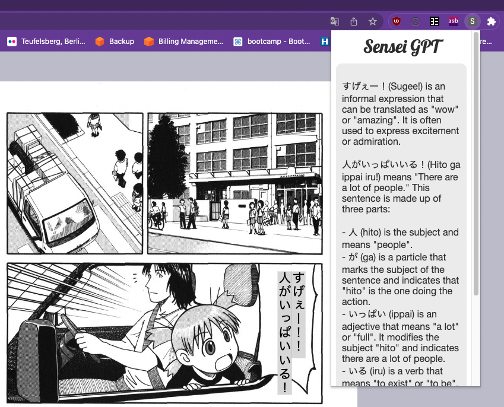
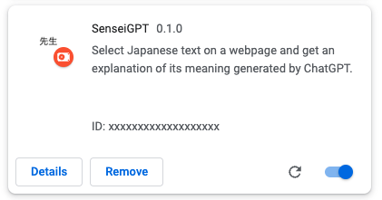

# SenseiGPT
Chrome extension that provides AI-generated breakdowns of Japanese text for language learners.

## How to use

Select a Japanese sentence in the web page you're currently reading, press `Ctrl+Shift+Y` (Windows) or `Command+Shift+Y` (mac) and get a full breakdown of its meaning from ChatGPT!

## Getting started

### OpenAI access
The extension uses the OpenAI api in the background. This requires an API key, which can be obtained as follow
1. Go to [https://platform.openai.com/account/api-keys](https://platform.openai.com/account/api-keys)
2. Sign up for an account if you don't already have one. Only paid accounts can use the API, so you will also need to upgrade your account by adding a payment method at [https://platform.openai.com/account/billing/overview](https://platform.openai.com/account/billing/overview).
3. Click `Create new secret key` and name it `SenseiGPT`
4. Take note of the key for later, as you won't be able to see it again if you close the tab

### Manual installation

The extension is still in development and is not available in the chrome store. Instead it needs to be installed manually using the following steps

1. Download the [latest release of the extension zip file](https://github.com/ceno/sensei-gpt/releases/download/v0.2.0/sensei-gpt-0.2.0.zip)
2. Unzip the file and take note of the folder it created
3. Go to the extensions page of your browser at the url [chrome://extensions](chrome://extensions)
4. Enable Developer Mode (on the top right of the extensions page)
5. Import the extension by dragging the unzipped folder and dropping it anywhere on the page

### Initial configuration

Add your API key
1. Click the `Details` button for SenseiGPT in chrome://extensions
2. Scroll down and click on `Extension options`
3. Paste your OpenAI API key and click `Save`

You're ready to go! To test everything worked try highlighting the following sentence, and pressing either Ctrl+Shit+Y or Cmd+Shift+Y: 頑張れ！
